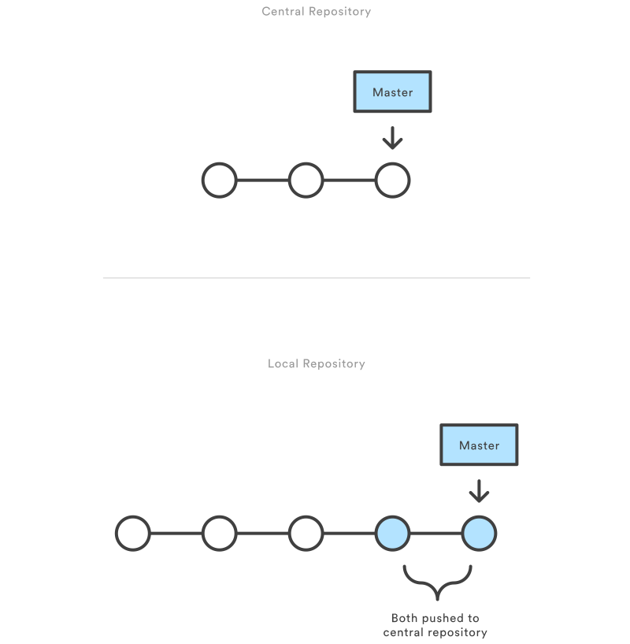

# Github Workflow

## Index
1. What is github?
2. What is a successful Github workflow?
3. Other common workflow
4. Summary


## what is github?


Introduction of github on wikipedia 
>GitHub is a web-based Git or version control repository and Internet hosting service. It is mostly used for code. It offers all of the distributed version control and source code management (SCM) functionality of Git as well as adding its own features. It provides access control and several collaboration features such as bug tracking, feature requests, task management, and wikis for every project.

As we have used github for many times, I only list some of features of github which can help us in thr workflow.

- Version control
- Issue tracking
- Pull requests with code review and comments

## What is a successful Github workflow?

Before talking about successful workflow, I want to mention some bad workflows.

### One commit, One push

Many github freshers always work like this.

- Writing and modifying code as same as the past(e.g:duplicate many code backup to add new features or fix bug)
- When they finally end their coding, they simply commit and push, leaving message like "finish all project..."

This kind of worflow also can be seen on us. It works well on small project like a single file of code, but it doesn't fit for github.


When evaluating a workflow for your team, it's most important that you consider your team’s culture. You want the workflow to enhance the effectiveness of your team and not be a burden that limits productivity. Some things to consider when evaluating a Git workflow are:

- Does this workflow scale with team size?
- Is it easy to undo mistakes and errors with this workflow?
- Does this workflow impose any new unnecessary cognitive overhead to the team?

Here I want to introduce a successful workflow.

### Centralized Workflow

The Centralized Workflow is a great Git workflow for teams transitioning from SVN. Like Subversion, the Centralized Workflow uses a central repository to serve as the single point-of-entry for all changes to the project. Instead of trunk, the default development branch is called master and all changes are committed into this branch. This workflow doesn’t require any other branches besides master.

### How it works

Developers start by cloning the central repository. In their own local copies of the project, they edit files and commit changes as they would with SVN; however, these new commits are stored locally - they’re completely isolated from the central repository. This lets developers defer synchronizing upstream until they’re at a convenient break point.

To publish changes to the official project, developers "push" their local master branch to the central repository. This is the equivalent of svn commit, except that it adds all of the local commits that aren’t already in the central master branch.

#### Initialize the central repository



First, someone needs to create the central repository on a server. If it’s a new project, you can initialize an empty repository. Otherwise, you’ll need to import an existing Git or SVN repository.

Central repositories should always be bare repositories (they shouldn’t have a working directory), which can be created as follows:

```
ssh user@host git init --bare /path/to/repo.git
```

Be sure to use a valid SSH username for user, the domain or IP address of your server for host, and the location where you'd like to store your repo for /path/to/repo.git. Note that the .git extension is conventionally appended to the repository name to indicate that it’s a bare repository.

#### Managing conflicts

The central repository represents the official project, so its commit history should be treated as sacred and immutable. If a developer’s local commits diverge from the central repository, Git will refuse to push their changes because this would overwrite official commits.


Before the developer can publish their feature, they need to fetch the updated central commits and rebase their changes on top of them. This is like saying, “I want to add my changes to what everyone else has already done.” The result is a perfectly linear history, just like in traditional SVN workflows.

If local changes directly conflict with upstream commits, Git will pause the rebasing process and give you a chance to manually resolve the conflicts. The nice thing about Git is that it uses the same git status and git add commands for both generating commits and resolving merge conflicts. This makes it easy for new developers to manage their own merges. Plus, if they get themselves into trouble, Git makes it very easy to abort the entire rebase and try again (or go find help).


## Other common workflow

The Centralized Workflow is more like SVN. But git has feature branching which can allow teams to work individually.

### Feature branching

Feature Branching is a logical extension of Centralized Workflow. The core idea behind the [Feature Branch Workflow](http://www.atlassian.com/git/tutorials/comparing-workflows/feature-branch-workflow) is that all feature development should take place in a dedicated branch instead of the master branch. This encapsulation makes it easy for multiple developers to work on a particular feature without disturbing the main codebase. It also means the master branch should never contain broken code, which is a huge advantage for continuous integration environments. 

### Forking Workflow

The [Forking Workflow](http://www.atlassian.com/git/tutorials/comparing-workflows/forking-workflow) is fundamentally different than the other workflows. Instead of using a single server-side repository to act as the “central” codebase, it gives every developer a server-side repository. This means that each contributor has not one, but two Git repositories: a private local one and a public server-side one. 


## Summary

Some key takeaways from this document are:

- There is no one-size-fits-all Git workflow
- A workflow should be simple and enhance the productivity of your team
- Your business requirements should help shape your Git workflow
